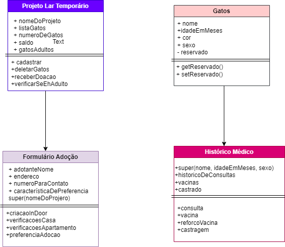

# Projeto Adoção de Gatinhos 🐈 🐾

## Contextualização:

O Instituto Pet Brasil estima que 185 mil animais estão sob tutela de organizações não governamentais (ONGs) e grupo de protetores animais. Estes animais geralmente estão em situação de abandono ou de maus tratos, estimando-se que cerca 40% destes animais são consequências de abandonos.

## Problema: 

Criar uma forma de organização e armazenamento de informações sobre os animais acolhidos e os adotantes de forma mais eficiente do que maneiras físicas, tais como, em papel.

##  Resolução do Problema
 A minha solução foi criar um sistema de cadastro de gatinhos em Node JS com seu acompanhamento médico e informações dos adotantes dos mesmos.

## Diagrama das Classes

## Técnicas Aplicadas no Projeto 
1. Programação Orientada a Objetos 
2. Testes Unitários utilizando a biblioteca Jest 